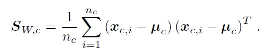

# Laboratory 3
In this laboratory we will implement Principal Component Analysis (PCA) and Linear Discriminant Analysis (LDA).

## Preliminary facts
This lab is based on the same dataset of the previous one, so the Iris dataset.
Libraries have been imported with the following aliases:
```Python
import numpy as np
import scipy.linalg as sc
```

## PCA
**PCA allows reducing the dimensionality of a dataset by projecting the data over the principal components**.  
So, **we obviously need to compute the principal components**. **They can be computed from the eigenvectors of the data covariance matrix corresponding to the largest eigenvalues**.  
**The first step therefore requires computing the data covariance matrix C**:  

  

where N is the total number of samples (**pay attention that we have 150 samples, each sample is to be intended as a 4x1 column vector**) and **_μ_** is the dataset mean vector computed as:  

  

where N is the same as before. We have a 4x150 matrix, we can compute the dataset mean by summing, for each row (which represents an attribute/a dimension), all the values along columns and by dividing by N=150. So we get the 1-dim vector **_μ_** with size 4 (not a single value!).  
As seen in the previous lab, we can compute the mean of an array by using the method .mean (it's faster than for loops). For example, if we have a 2-D array (4x150, as in our problem), we can use the .mean method with the axis parameter to compute the mean along rows or columns. axis=0 allows computing the mean of the rows (sum all the elements of a COLUMN and divide by 4), axis=1 allows computing the means of the columns (sum all the elements of a ROW and divide by 150).  
We can compute the dataset mean as:
```Python
mu = D.mean(axis=1)
```
As in the previous lab, mu is a 1-dim vector of size 4, we can center the data by doing: 
```Python
mu = vcol(mu, mu.size)  #reshape mu as a 4x1 array on 2 dimensions
DC = D - mu    #exploit numpy's broadcasting to remove the mean from all columns of D
```
Now we have the matrix of centered data, DC. The formula of the covariance matrix can now be simplified as:  

  

which is easier to implement. In fact, we can do it by using the _numpy.dot_ operator:
```Python
C = (1/DC.shape[1]) * (np.dot(DC, DC.T))  # DC.shape[1] is 150, it's the N parameter
```
**Now we have the covariance matrix C. We need to compute its eigenvectors and eigenvalues in order to get the principal components**. We can use two different methods.  
1\) (**Chosen for this exercise**)  
For a generic square matrix (like in our case, **C** is a 4x4 matrix) we can use the library function _numpy.linalg.eig_ .  
Since the covariance matrix is symmetric, we can use a more specific function that is _numpy.linalg.eigh_ :
 ```Python
 s, U = np.linalg.eigh(C)
 ```
 This function will return the eigenvalues **s**, **sorted from smallest to largest**, and the corresponding eigenvectors (columns of **U**). eig does not, instead, sort the eigenvalues and eigenvectors. The m leading eigenvectors can be retrieved from **U** as:
 ```Python
 P = U[:, ::-1][:, 0:m]
 ```
 where the first part allows to reverse the order of the columns of **U** so that the leading eigenvectors are in the first m columns and the second part is just a slice to extract them.  
2\) The covariance matrix (n x m, in general) admits a Singular Value Decomposition (SVD) of the form:  

  

SVD can be applied to a generic rectangular matrix (there's even no need for the matrix to be a square or symmetric). **U** will be an orthogonal n x n matrix of eigenvectors of **C** **C**<sup>T</sup>. **V** will be an orthogonal m x m matrix of eigenvectors of **C**<sup>T</sup> **C**. **Σ** will be a diagonal rectangular matrix containing the singular values of **C** (in decreasing order). In general, the singular values of a n x m matrix **X** are the square roots of the eigenvalues of the m x m matrix **X**<sup>*</sup> **X** (where * stands for the transpose-conjugate matrix if it has complex coefficients, or the transpose if it has real coefficients).  
The text reports "Since the covariance matrix is semi-definite positive..." as if it was a prerequisite, it's not very clear. The matrix is indeed semi-definite positive because its eigenvalues are all >= 0 (it's also definite positive, because its eigenvalues are all > 0, but the semi-definite positive request is enough for our purposes). The point is, if **C** is a **n x n real symmetric matrix with non-negative eigenvalues** (like in our case!), **then eigenvalues and singular values coincide, but it is not generally the case**!  
So here we can also get the sorted eigenvectors from the SVD. In fact, **V**<sup>T</sup>=**U**<sup>T</sup>, thus **UΣV**<sup>T</sup>=**UΣU**<sup>T</sup> and **UΣU**<sup>T</sup> is also an eigen-decomposition of **C** ([see here](https://en.wikipedia.org/wiki/Eigendecomposition_of_a_matrix#Real_symmetric_matrices)).  
The SVD can be computed by:
```Python
U, s, Vh = np.linalg.svd(C)
```
In this case, the singular values (which are equal to the eigenvalues, as explained above) are sorted in descending order, and the columns of U are the corresponding eigenvectors:
```Python
P = U[:, 0:m]
```
_Note_: by using this method the scatter plot is somehow overturned with respect to the result shown on the text. It's correct, since we could obtain eigenvalues with opposite signs, but this is the reason why I used the first method, because its output is the same of the text. I've implemented this version anyway, just for exercise, it can be tested by uncommenting the proper function.  

**In P we have the m principal components that we were looking for. We can finally apply the projection to the matrix of samples D** as:
```Python
DP = np.dot(P.T, D)
```
In our case P.T is a m x 4 matrix, while D is a 4 x 150 matrix. DP will be a m x 150 matrix.  

The lab text asks to compute the PCA projection matrix for any dimensionality m (m < 4, which is the current dimension of the problem) and to map the IRIS dataset with dimension 2 to a 2-D space (through a scatter plot). So, the code is organized accordingly and the scatter plot function is similar to that of the previous lab. x-axis is the first principal direction, while y-axis is the second principal direction. My scatter plot is:  

  

## LDA
**We are interested in looking for the m most discrimant directions. We represent these directions as a matrix W, whose columns contain the directions we want to find.  
To compute the LDA transformation matrix W we need to compute the between and within class covariance matrices**:  

  

where **x<sub>c,i</sub>** is the i-th sample of class c (intended as a 4x1 column vector, since each sample has 4 dimensions), n<sub>c</sub> is the number of samples of class c (n<sub>c</sub>=50 in our case), K is the total number of classes (K=3 in our case), N is the total number of samples (N=n<sub>1</sub>+n<sub>2</sub>+...+n<sub>K</sub>, N=150 in our case), **_μ_** is the dataset mean (same that was in PCA) and **_μ<sub>c</sub>_** is the mean of the class c.  
These two matrices can be computed as described below:

1. The between class covariance matrix can be computed directly from its definition.

2. The general formula for the within class covariance matrix **S<sub>W</sub>** that has been presented above can be rewritten as a weighted sum of the covariance matrices of each class:  
  
where:  
  
The covariance of each class **S<sub>W,c</sub>** can be computed as we did for PCA:  
* Compute the mean for the **class** samples
* Remove the mean from the **class** data
* Compute **S<sub>W,c</sub>** (similar to what we've done in PCA for the matrix C)  

_Note_: As seen in the previous lab, in the IRIS dataset classes are labeled as 0 (Iris-setosa), 1 (Iris-versicolor), 2 (Iris-virginica) and this information is stored into the 1-dim array L. We can select the samples of the i-th class as:
```Python
D[:, L==i]
```
The functions _computeBetweenClassCovarianceMatrix_ and _computeWithinClassCovarianceMatrix_ allow computing the two matrices.
Once we have computed the matrices, we need to find the solution to the LDA objective. We analyze two methods to compute the LDA directions.  
1\) **Generalized eigenvalue problem (chosen for this exercise)**  
The LDA directions (=columns of **W**) can be computed by solving the generalized eigenvalue problem:  
  
Assuming that **S<sub>W</sub>** is positive definite (=all eigenvalues are >0, we can verify it by printing **S<sub>W</sub>** matrix), we can use the _sc.eigh_ function which solves the generalized eigenvalue problem for hermitian (including real symmetric) matrices. Notice that _np.linalg.eigh_ function cannot be used because it does not solve the generalized problem. Notice also the fact that we pass both **S<sub>B</sub>** and **S<sub>W</sub>** to the function:  
```Python
s, U = sc.eigh(SB, SW)
W = U[:, ::-1][:, 0:m]
```
2\) **Solving the eigenvalue problem by joint diagonalization of S<sub>W</sub> and S<sub>B</sub>**  
We have seen that **the LDA solution can also be implemented through a first transformation that makes the within class covariance matrix S<sub>W</sub> become the identity matrix and a second transformation that makes the between class covariance matrix S<sub>B</sub> become a diagonal matrix**.  
**The first step consists in estimating matrix P<sub>1</sub> such that the within class covariance of the transformed points P<sub>1</sub>D is the identity matrix**. Remember that applying the linear transformation **P**<sub>1</sub>**D** to our dataset, covariance matrices transform as **P**<sub>1</sub>**ΣP**<sub>1</sub><sup>T</sup>. The matrix **P**<sub>1</sub> can be computed as:  
  
where **UΣU**<sup>T</sup> is the SVD of **S<sub>W</sub>**. The SVD can be computed as:
```Python
U, s, _ = np.linalg.svd(SW)
```
s is a 1-dim array containing the diagonal of **Σ**, so the diagonal of **Σ**<sup>-0.5</sup> can be computed as:
```Python
1.0/s**0.5
```
We can exploit broadcasting to compute **UΣ**<sup>-0.5</sup> as:
```Python
U * vrow(1.0/s**0.5)
```
_Note_: There's an error here, the dimension for the reshaping is not specified, but it doesn't matter at the moment since I will use another version of this instruction.

P<sub>1</sub> can then be computed as:
```Python
P1 = np.dot(U*vrow(1.0/(s**0.5)), U.T)
```
_Note_: Same error.  

We can also use _np.diag_ to build a diagonal matrix from a one-dimensional array (this is the instruction used in the code and it works):
```Python
P1 = np.dot(np.dot(U, np.diag(1.0/(s**0.5))), U.T)
```
**The transformed between class covariance S<sub>BT</sub> can be computed as**:
```Python
SBT = np.dot(np.dot(P1,SB), P1.T)
```
**We finally need to compute the matrix P<sub>2</sub> of eigenvectors of S<sub>BT</sub> corresponding to its m highest eigenvalues**. We can do it as:
```Python
_, U = np.linalg.eig(SBT)
P2 = U[:, ::-1][:, 0:m]
```
 Remember that we can compute **at most 2** discriminant directions, since we have 3 classes.  
 The transformation from the original space to the LDA subspace can then be expressed as **y** = **P<sub>2</sub><sup>T</sup>P<sub>1</sub>D**. Thus, **the LDA matrix W is given by W = P<sub>1</sub><sup>T</sup>P<sub>2</sub> and can be computed as**:
```Python
W = np.dot(P1.T, P2)
```
**and the LDA transformation is DP = W<sup>T</sup>D, which can be computed as:**
```Python
DP = np.dot(W.T, D)
```

Now we can verify the output.  
My scatter plot is:


## Conclusions 
PCA is unsupervised: there's no guarantee of obtaining discriminant directions. This means that we may obtain a subspace where classes overlap (as seen in the obtained PCA scatter plot, where Versicolor and Virginica overlap along x-axis).  
Another solution is LDA. It allows to look for the **m most discriminant directions**, where m is at most c-1 (with c number of classes involved). This means that the subspace will show classes with less overlap (as seen in the obtained LDA scatter plot, where Versicolor and Virginica are now better separated along x-axis).