# Laboratory 4
In this laboratory we will focus on computing probability densities and ML estimates.  
Here you can find some clarifications, especially on mathematical formulas which are difficult to understand from the code. Other informations are available as comments in the code.

## Preliminary facts
Libraries have been imported with the following aliases:

```Python
import numpy as np
```

## Gaussian density estimation

### GAU_pdf(x, mu, var) function
This function computes the normal density for all samples of the 1-D array x as:  
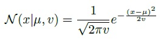  
The function returns a 1-D array y, with y<sub>i</sub>=_N_(x<sub>i</sub>|μ,_v_).

### GAU_logpdf(x, mu, var) function
This function computes the log-density. Same behavior of GAU_pdf, except for the formula that is:  
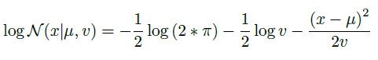  

### computeLikelihood(dataset, mu, var) function
This function computes the likelihood of _dataset_ as:  
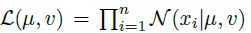  
by calling GAU_pdf and multiplying all the elements of the normal density array.

### computeLogLikelihood(dataset, mu, var) function
This function computes the log-likelihood of _dataset_ as:  
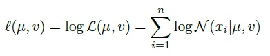  
by calling GAU_logpdf and summing all the elements of the log-density array.

### computeMaximumLikelihoodEstimates(dataset) function
This function computes the Maximum Likelihood (ML) estimates that better describe _dataset_. They are given by:  
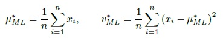  

### Results of Gaussian ML estimate
The obtained plot is:  
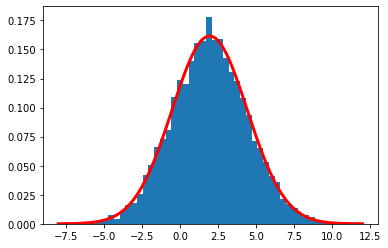  
As we can see, we have a good fit of the histogram and the density well represents the distribution of the data. Clearly, if we reduce the number of samples used to estimate the ML parameters there's no guarantee that the fit will be as good as it is now. For example, if we reduce the number of samples from 10000 to 100 the plot will be like this:  
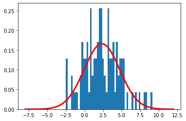  

## Multivariate Gaussian

### logpdf_GAU_ND(x, mu, sigma) function
This function computes the Multivariate Gaussian (MVG) log-density, which is defined as:  
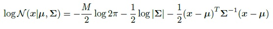  
where M is the size of the feature vector **x**, |**Σ**| is the determinant of **Σ**.  
The parameters x and mu should be numpy arrays of shape (M, 1) while sigma should be a numpy array of shape (M, M) representing the covariance matrix **Σ**.  
For this part a solution has already been prepared, so we can just load it along with the data used to get it and we can check if our logpdf_GAU_ND function lead us to the same result.  
There are two ways to compute the MVG log-density:  
1. We can implement the formula as is. About the last product between matrices:  
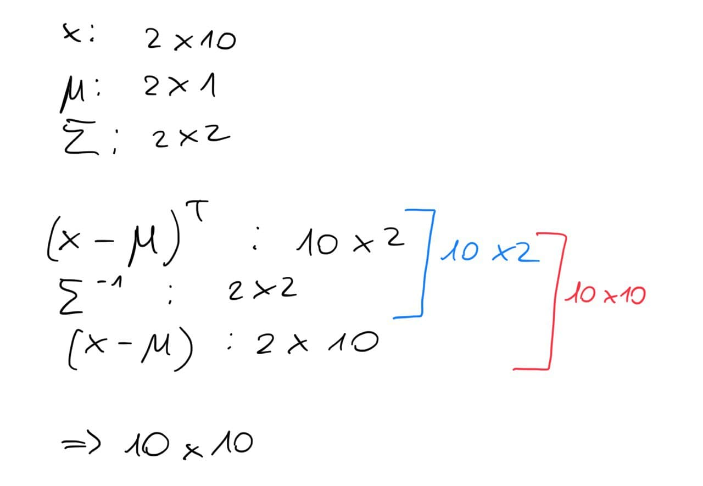  
then the result will be a 10x10 matrix, but it isn't exactly what we were expecting. In fact, for us the **x** of the formula is a feature vector that represents a single sample, considering that we have 10 samples we should get a 1-D array of 10 values. If we try to print the result of the solution and our 10x10 matrix we will notice that the element of the solution are the elements of the main diagonal of our matrix, so to get the final result we can use np.diag.  
2. We want to verify if there is a way to compute the solution without using np.diag and without using for loops (which are slow):  
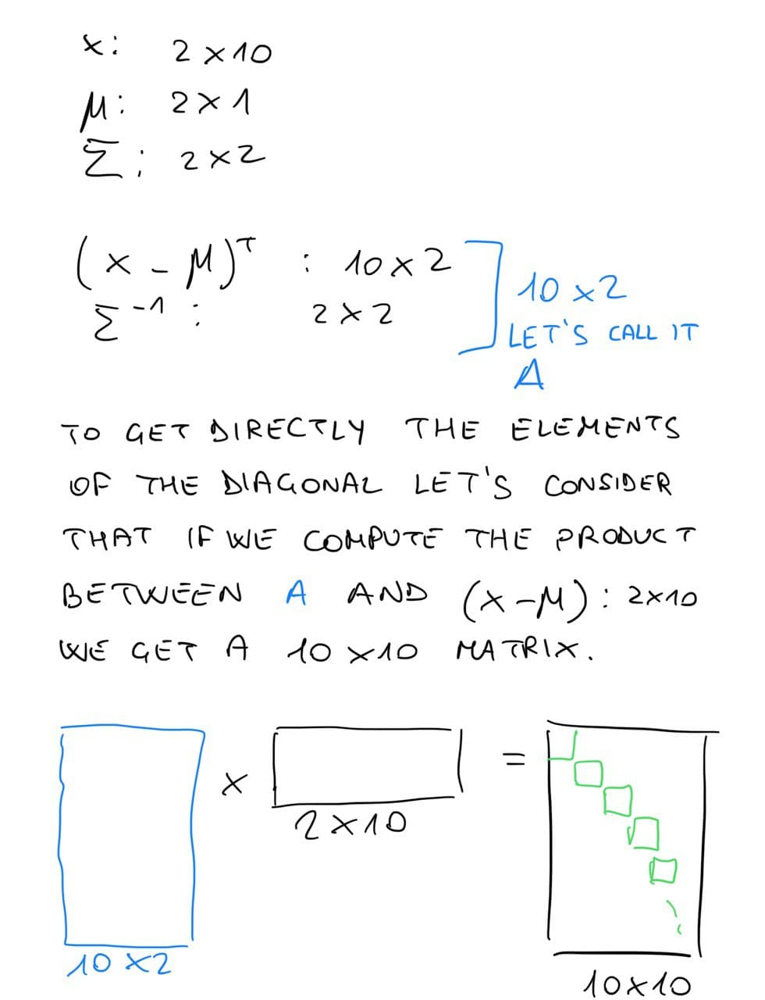  
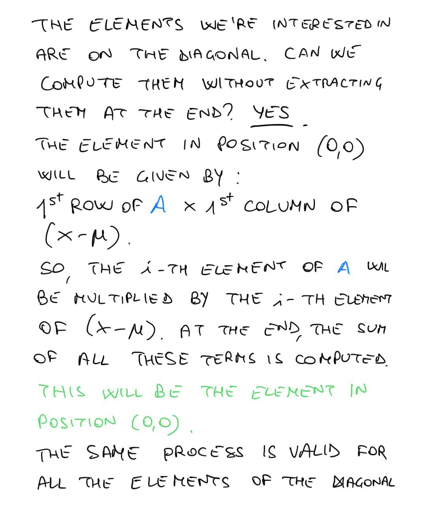  
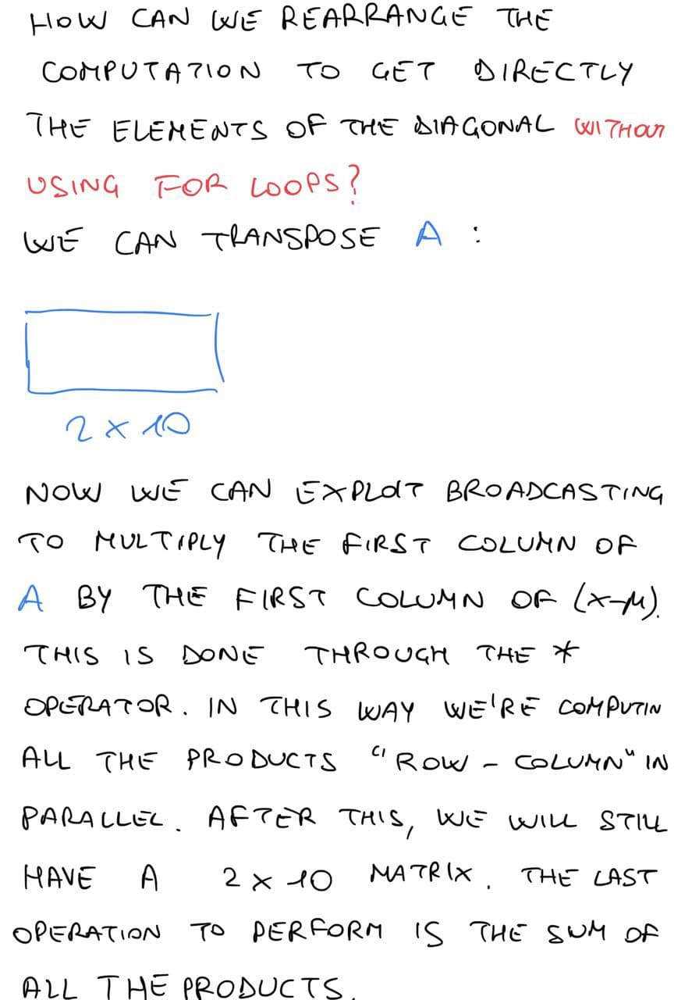  
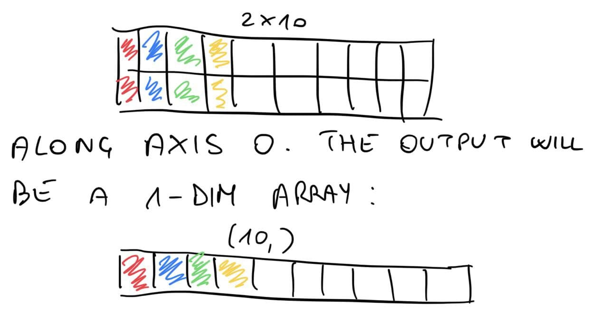  